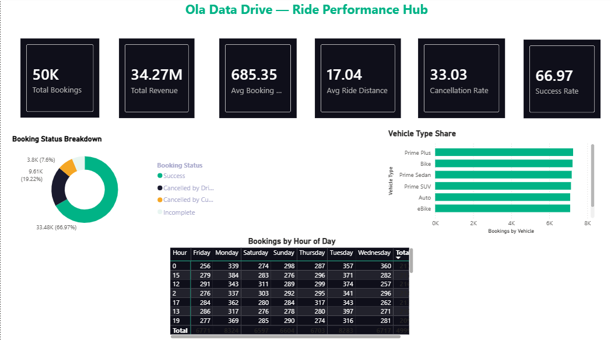
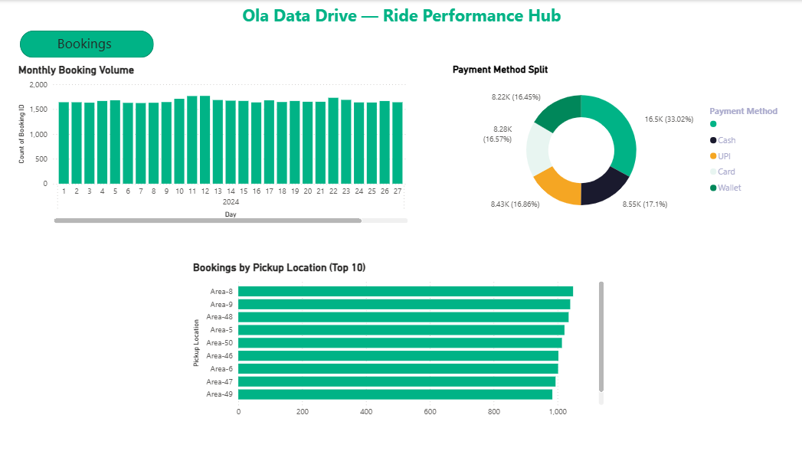
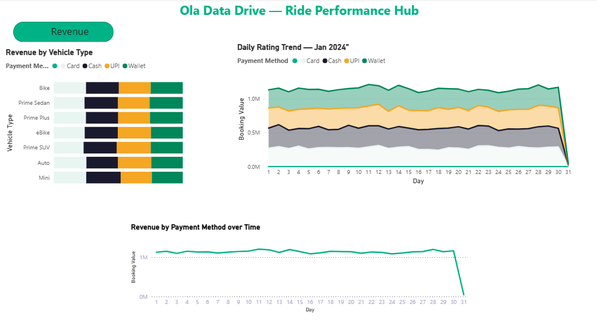
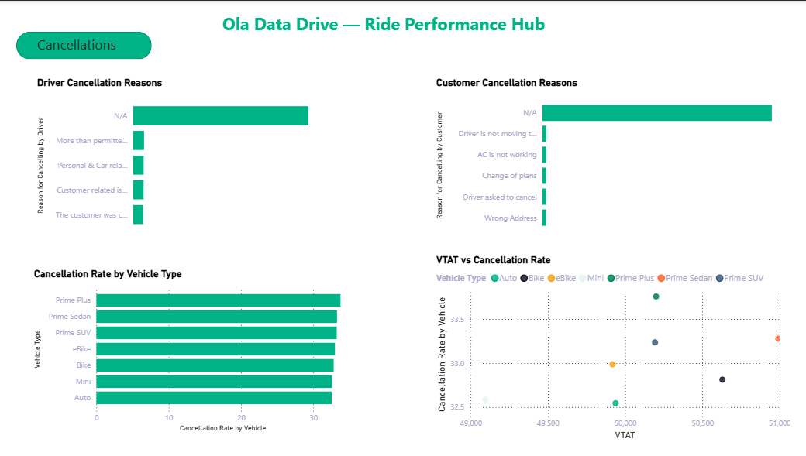
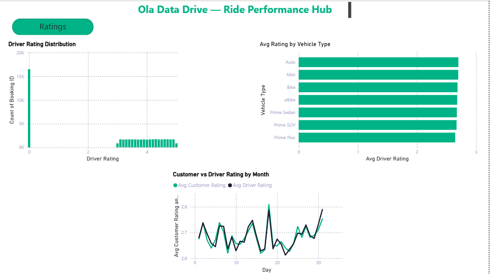

<div align="center">

# OLA Data Drive — Ride Performance Hub



<br/>

[](https://powerbi.microsoft.com/)
[](https://python.org/)
[](#)
[](#)
[](https://www.kaggle.com/)

**An end-to-end Power BI analytics dashboard on OLA ride-hailing operations — January 2024**

[View Dashboard Pages](#dashboard-pages) · [Key Insights](#key-insights) · [Tech Stack](#tech-stack) · [Getting Started](#getting-started)

</div>

---

## Project Objective

The goal of this project is to analyze OLA ride-hailing data for January 2024 and build an interactive Power BI dashboard that provides actionable insights across four key business areas — bookings, revenue, cancellations, and ratings. The project covers the complete data pipeline from raw data extraction using SQL and Python preprocessing to DAX-powered KPIs and visual storytelling in Power BI, enabling data-driven decisions around operational efficiency, customer experience, and revenue optimization.

---

## At a Glance

<div align="center">

| Total Bookings | Total Revenue | Avg Booking Value | Avg Ride Distance | Success Rate | Cancellation Rate |
|:-:|:-:|:-:|:-:|:-:|:-:|
| **50,000** | **34.27M** | **685.35** | **17.04 km** | **66.97%** | **33.03%** |

</div>

---

## Dashboard Pages

<details>
<summary><b>Bookings</b> — Monthly volume, payment splits & top pickup zones</summary>
<br/>

</details>

<details>
<summary><b>Revenue</b> — Daily trends, vehicle earnings & payment method breakdown</summary>
<br/>

</details>

<details>
<summary><b>Cancellations</b> — Driver vs customer reasons, vehicle rates & VTAT analysis</summary>
<br/>

</details>

<details>
<summary><b>Ratings</b> — Driver rating distribution, vehicle averages & monthly trends</summary>
<br/>

</details>

---

## Key Insights

### Bookings
> - Daily volume stays **steady at 1,500–2,000 rides/day** with no major spikes — strong operational consistency
> - **Wallet** leads payment preference at **33%**, followed by Cash (17.1%), UPI (16.86%), and Card (16.57%) — digital payments dominate
> - **Area-8 & Area-9** are the busiest pickup zones, suggesting high-density demand hotspots worth prioritizing for driver allocation

### Revenue
> - Revenue holds at a **stable ~1M/day** for most of January, with an unexpected **sharp drop on Day 31** worth investigating
> - **Bike generates the highest revenue** across vehicle types — likely driven by high volume and frequency
> - **Wallet and Cash** together contribute the bulk of booking value across all vehicle segments

### Cancellations
> - **"N/A"** dominates both driver and customer cancellation reasons — a **data quality gap** that limits actionability; improving capture at source is recommended
> - Among known reasons, drivers cite **"More than permitted"** most; customers cite **"Driver not moving"** and **"AC not working"** — operational and comfort issues are primary friction points
> - **Prime Plus, Prime Sedan & Prime SUV** show the highest cancellation rates (~32–35%), suggesting premium rides face more expectation mismatches
> - **VTAT vs Cancellation Rate** scatter shows no strong correlation — cancellations are not simply a wait-time problem

### Ratings
> - Rating distribution is **heavily skewed to 0** — most rides go unrated, signaling a need for better in-app rating prompts
> - **All vehicle types average ~2.5–3**, with **Auto slightly leading** — consistently modest scores across the board
> - **Customer and Driver ratings track closely** throughout January (2.6–2.8), with a notable **spike around Day 19–20**

---

## Tech Stack

| Layer | Tool | Purpose |
|-------|------|---------|
| Visualization | **Power BI Desktop** | Dashboard design, interactivity, report pages |
| Calculation | **DAX** | KPIs — Success Rate, Cancellation Rate, Avg Value |
| Processing | **Python (pandas)** | Data cleaning, null handling, feature engineering |
| Querying | **SQL** | Data extraction, aggregations, filtering |
| Data Source | **Kaggle** | Raw OLA ride-booking dataset |

---

## DAX Measures

```dax
-- Success Rate
Success Rate =
DIVIDE(
    COUNTROWS(FILTER('Bookings', 'Bookings'[Status] = "Success")),
    COUNTROWS('Bookings')
) * 100

-- Cancellation Rate
Cancellation Rate =
DIVIDE(
    COUNTROWS(FILTER('Bookings', 'Bookings'[Status] <> "Success")),
    COUNTROWS('Bookings')
) * 100

-- Average Booking Value
Avg Booking Value = AVERAGE('Bookings'[Booking_Value])

-- Total Revenue
Total Revenue = SUM('Bookings'[Booking_Value])
```

---

## Python — Data Preprocessing

```python
import pandas as pd

df = pd.read_csv('ola_bookings.csv')

# Fill missing cancellation reasons
df['Reason for Cancelling by Driver'].fillna('N/A', inplace=True)
df['Reason for Cancelling by Customer'].fillna('N/A', inplace=True)

# Extract booking hour for time-of-day analysis
df['Hour'] = pd.to_datetime(df['Booking_Time']).dt.hour

# Clean numeric columns
df['Booking_Value'] = pd.to_numeric(df['Booking_Value'], errors='coerce')
df['Ride_Distance'] = pd.to_numeric(df['Ride_Distance'], errors='coerce')

print(df.describe())
print(df['Status'].value_counts(normalize=True))
```

---

## SQL — Sample Queries

```sql
-- Revenue & bookings by vehicle type
SELECT
    Vehicle_Type,
    COUNT(Booking_ID)       AS Total_Bookings,
    SUM(Booking_Value)      AS Total_Revenue,
    AVG(Ride_Distance)      AS Avg_Distance
FROM ola_bookings
GROUP BY Vehicle_Type
ORDER BY Total_Revenue DESC;

-- Cancellation rate by vehicle
SELECT
    Vehicle_Type,
    ROUND(
        SUM(CASE WHEN Status != 'Success' THEN 1 ELSE 0 END) * 100.0
        / COUNT(*), 2
    ) AS Cancellation_Rate_Pct
FROM ola_bookings
GROUP BY Vehicle_Type
ORDER BY Cancellation_Rate_Pct DESC;

-- Top 10 pickup locations
SELECT TOP 10
    Pickup_Location,
    COUNT(Booking_ID) AS Total_Bookings
FROM ola_bookings
GROUP BY Pickup_Location
ORDER BY Total_Bookings DESC;
```

---
---

## Getting Started

```bash
# 1. Clone the repository
git clone https://github.com/your-username/OLA-Data-Drive.git
cd OLA-Data-Drive

# 2. Install Python dependencies
pip install pandas numpy matplotlib seaborn

# 3. Open the Power BI template
#    Launch Power BI Desktop
#    Open OLA_Data_Drive.pbit
#    Connect to your dataset when prompted
```

---

## Dataset

- **Source:** [Kaggle — OLA Ride Bookings](https://www.kaggle.com)
- **Period:** January 2024
- **Volume:** ~50,000 ride records
- **Key Fields:** `Booking_ID`, `Vehicle_Type`, `Pickup_Location`, `Drop_Location`, `Ride_Distance`, `Booking_Value`, `Payment_Method`, `Driver_Rating`, `Customer_Rating`, `Cancellation_Reason`, `Status`

---

## Author

**Garvit Singh**
Aspiring Data Analyst | Power BI Enthusiast

[](https://linkedin.com)
[](https://github.com)

---

## Support

If you found this project useful, give it a star on GitHub!

[](https://github.com/your-username/OLA-Data-Drive)

## Project Structure
